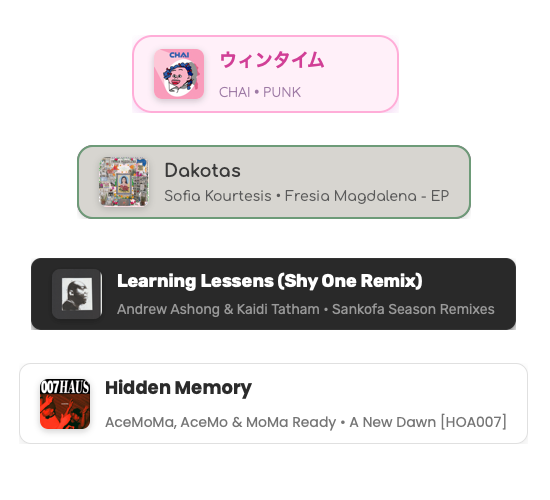

# Jam Deck for OBS: Apple Music Stream Display

A customizable Apple Music now playing display for macOS.



## Features

- Shows currently playing Apple Music track on your stream.
- Five beautiful themes (Natural, Twitch, Dark, Pink, Light).
- Adaptive or Fixed width display options.
- Automatically hides when no music is playing.
- Support for album artwork.
- Clean animated transitions between songs.
- Settings menu appears only on hover (invisible to viewers).
- Scene-specific settings saved between sessions.
- Menu bar app for easy access to all controls.
- One-click scene URL copying with optional auto-open in browser.

## Requirements

- macOS (uses AppleScript to communicate with Apple Music).
- Python 3.6 or later.
- OBS Studio or similar streaming software with browser source support.

## Installation

### Option 1: Menu Bar App (Recommended)

1. Download the latest Jam Deck.app from the Releases page.
2. Move to your Applications folder.
3. Launch Jam Deck from your Applications folder.
   - If you see a warning about an app from an unidentified developer, see [Apple's guide](https://support.apple.com/guide/mac-help/open-a-mac-app-from-an-unknown-developer-mh40616/mac).
4. The app will appear in your menu bar with a musical note icon.
5. The server starts automatically when you launch the app.

### Option 2: Manual Installation

1. Clone this repository:
   ```
   git clone https://github.com/yourusername/jam-deck.git
   cd jam-deck
   ```

2. Make sure the Python script is executable:
   ```
   chmod +x music_server.py
   ```

3. Start the server:
   ```
   ./music_server.py
   ```

### Setting Up OBS

Add a Browser Source in OBS:
- URL: `http://localhost:8080/` or use the app to copy a scene-specific URL
- Width: 400 (recommended minimum)
- Height: 140
- Check "Refresh browser when scene becomes active"

## Usage

Once installed, the overlay will automatically display your currently playing Apple Music tracks.

### Menu Bar App

Jam Deck's menu bar app provides easy access to all features directly from your Mac's menu bar:

1. **Server Control**
   - Click "Start Server" to begin displaying your music.
   - Click "Stop Server" when you're done streaming.

2. **Scene Management**
   - Under "Copy Scene URL," select any scene to copy its URL to the clipboard.
   - Each scene can have its own saved theme and width settings.
   - Use "Add New Scene..." to create custom scenes for different parts of your stream.
   - Use "Manage Scenes..." to rename or delete existing scenes.

3. **Browser Integration**
   - Click "Open in Browser" to preview how your overlay looks.
   - Toggle "Auto-open URLs in Browser" to control whether scene URLs automatically open when copied:
     - When enabled (✓): Copying a scene URL will also open it in your browser.
     - When disabled: URLs are only copied to clipboard without opening.

4. **OBS Setup**
   - Copy scene URLs directly from the menu.
   - Paste into OBS Browser Source properties.

The menu bar app stores your preferences between sessions, so your auto-open setting and scenes will be remembered when you restart.


### Theme Selection

Hover over the overlay to reveal the settings menu at the bottom:

- **Natural** (default): Soft green theme with rounded corners.
- **Twitch**: Dark purple theme that matches Twitch aesthetics.
- **Dark**: Sleek black theme with cyan accents.
- **Pink**: Vibrant pink theme with friendly typography.
- **Light**: Clean white theme with blue accents.

### Width Options

In the settings menu:

- **A**: Adaptive width (only as wide as needed for the text).
- **F**: Fixed width (expands to fill the entire browser source width, default).


## Troubleshooting

**No music information appears:**
- Make sure Apple Music is running.
- Check Terminal for error messages.
- Try playing/pausing music to trigger an update.

**Permission errors:**
- macOS may need permission to control Apple Music.
- Go to System Preferences → Security & Privacy → Automation.
- Ensure Terminal (or whatever app runs the script) has permission to control Apple Music.

## Auto-Start on Boot

### Using the Menu Bar App

If you're using the menu bar app (Option 1 installation):

1. Go to System Preferences → Users & Groups → Login Items.
2. Click the "+" button.
3. Browse to your Applications folder and select "Jam Deck.app"
4. The app will now start automatically at login.

### Using the Manual Installation

If you're using the manual installation:

1. Create an Automator application:
   - Open Automator.
   - Create a new Application.
   - Add a "Run Shell Script" action.
   - Enter: `cd /path/to/jam-deck && ./music_server.py`
   - Save as "Start Jam Deck"

2. Add to Login Items:
   - System Preferences → Users & Groups → Login Items
   - Add the Automator application you created.

## Customization

Advanced users can modify the CSS in `overlay.html` to create custom themes or change the layout.

### Changing the Port

By default, the server runs on port 8080. To change this (Manual installation only):

1. Open `music_server.py` in a text editor.
2. Find the line near the top that says `PORT = 8080`
3. Change `8080` to your desired port number.
4. Save the file and restart the server.
5. Update your browser source URL in OBS to use the new port.

## Building from Source

If you want to build the Jam Deck menu bar app from source:

1. Clone the repository:
   ```
   git clone https://github.com/yourusername/jam-deck.git
   cd jam-deck
   ```

2. Install py2app:
   ```
   pip install py2app
   ```

3. Run the build script:
   ```
   python setup.py py2app
   ```

4. The built application will be available in the `dist` directory.

### Build Scripts

- `setup.py`: Main build configuration for py2app
- `collect_zmq.py`: Helper script to ensure ZeroMQ libraries are properly included in the build

## License

[MIT License](LICENSE)